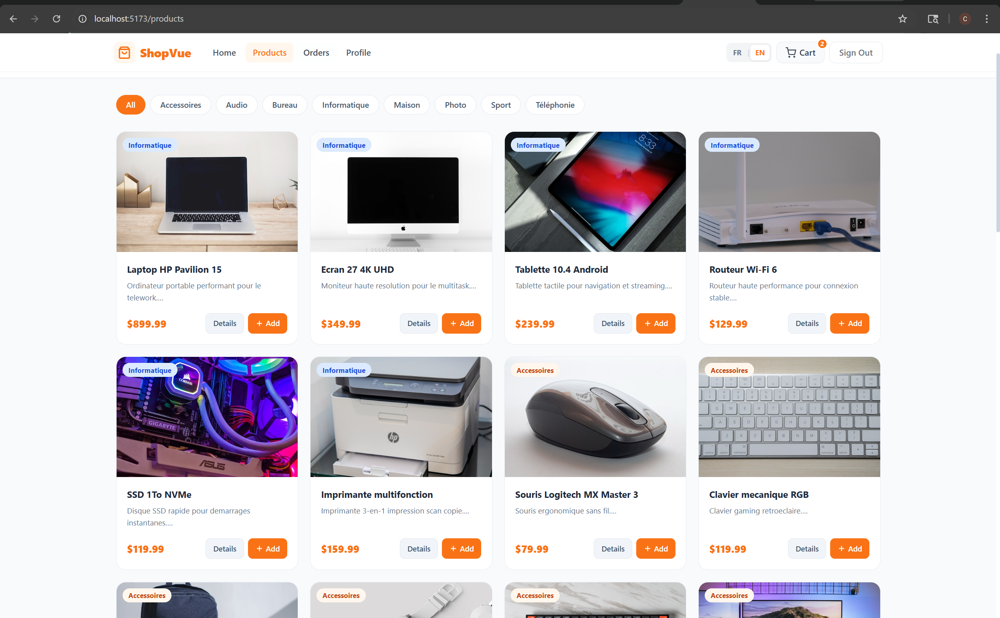
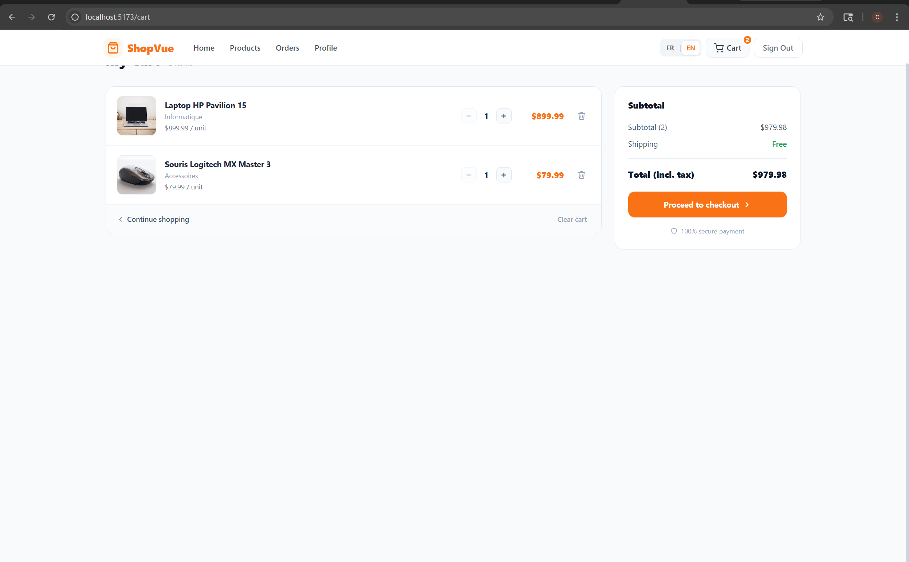
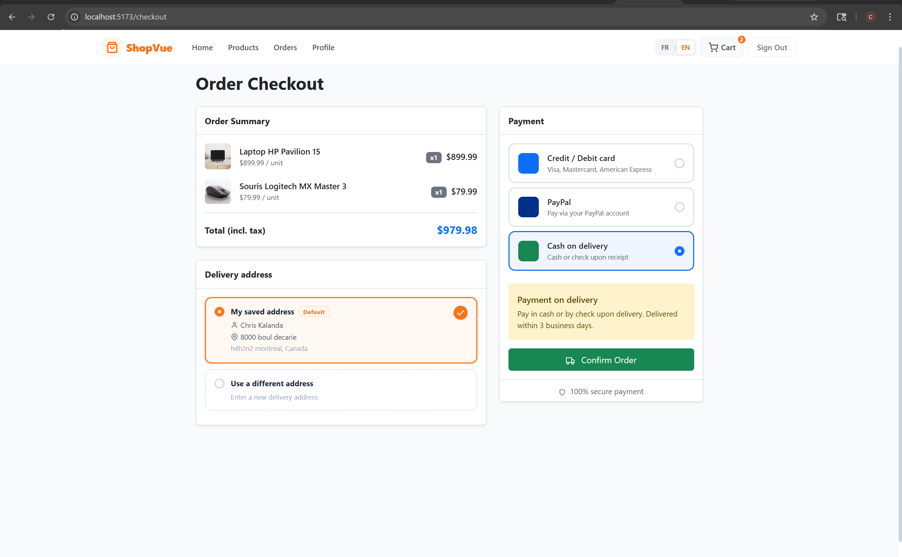
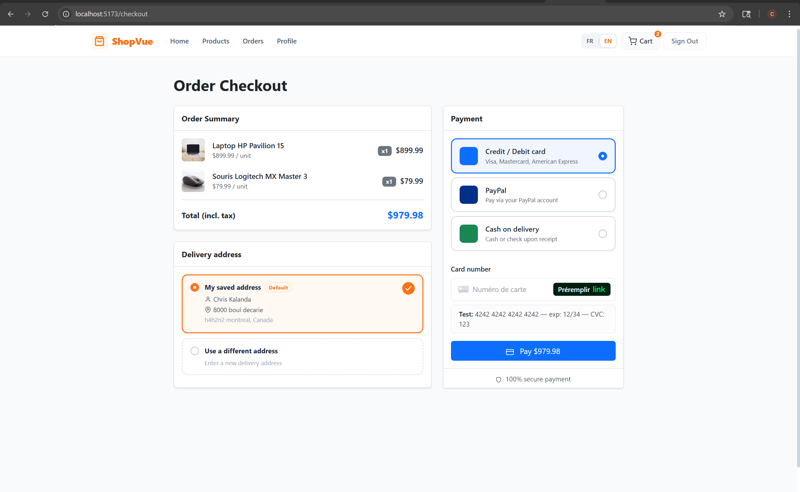
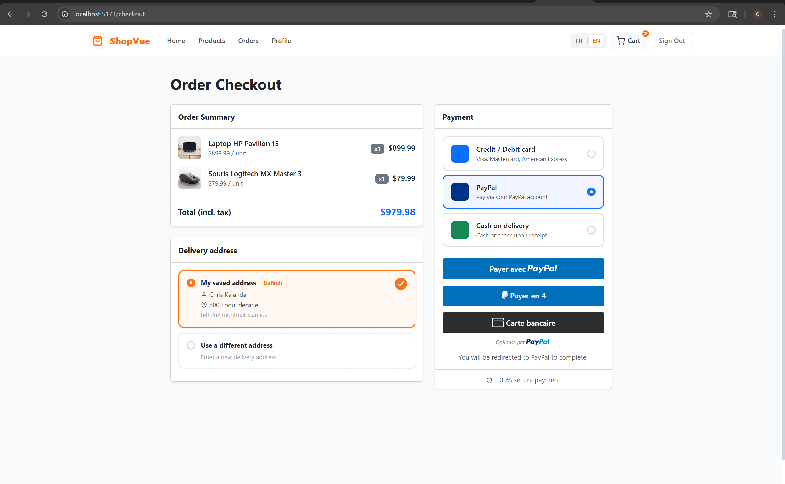
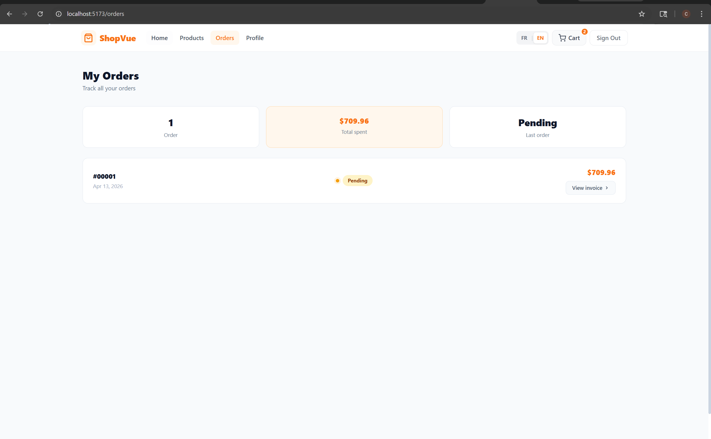
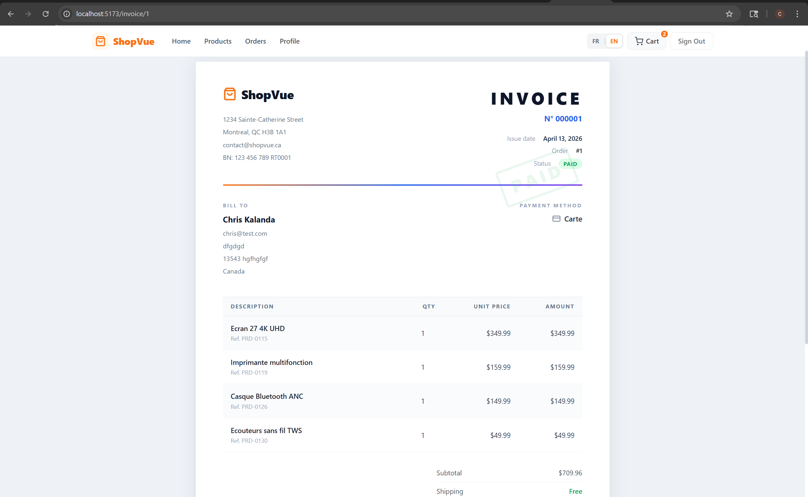
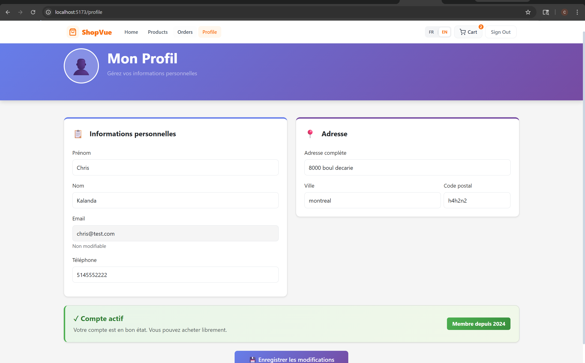

# ShopVue — Full-Stack E-Commerce Application

> A modern, production-ready e-commerce platform built with **Vue.js 3**, **Node.js / Express**, and **MySQL** — featuring Stripe & PayPal payments, bilingual UI (FR/EN), and a professional invoice system.

---

## Table of Contents

- [Overview](#overview)
- [Tech Stack](#tech-stack)
- [Features](#features)
- [Application Preview](#application-preview)
- [Project Structure](#project-structure)
- [Database Schema](#database-schema)
- [API Reference](#api-reference)
- [Getting Started](#getting-started)
- [Environment Variables](#environment-variables)
- [Payment Configuration](#payment-configuration)
- [Seed Data](#seed-data)
- [Notes](#notes)

---

## Overview

**ShopVue** is a full-stack e-commerce web application designed to simulate a real online store experience. It covers the entire shopping journey — from product discovery to order confirmation — with a clean, responsive UI and a secure backend API.

Built as part of an academic web development project, the app integrates real payment gateways (Stripe & PayPal sandbox), JWT-based authentication, and a bilingual interface (French / English) with Canadian Dollar (CAD) currency formatting.

---

## Tech Stack

### Frontend
| Technology | Purpose |
|---|---|
| Vue.js 3 (Options API) | UI framework |
| Vue Router 4 | Client-side routing |
| Vite 6 | Build tool & dev server |
| Bootstrap 5 | Responsive layout & utilities |
| Axios | HTTP client with JWT interceptors |
| Stripe.js (CDN) | Secure card input (PCI compliant) |
| PayPal JS SDK (CDN) | PayPal button rendering |

### Backend
| Technology | Purpose |
|---|---|
| Node.js (ES Modules) | Runtime |
| Express 4 | REST API framework |
| MySQL 2 | Relational database driver |
| jsonwebtoken | JWT authentication |
| bcryptjs | Password hashing |
| Stripe Node SDK | Payment Intent creation |
| PayPal REST API v2 | Order creation & capture |
| dotenv | Environment variable management |
| nodemon | Development auto-restart |

---

## Features

### Shopping Experience
- **Product catalog** — 30+ products with category filtering and live search
- **Product detail pages** — full description, stock indicator, add-to-cart
- **Smart cart** — quantity controls, real-time subtotal, persisted in `localStorage`
- **Category navigation** — visual image cards linking to filtered product pages

### Checkout & Payments
- **Multi-method payment** — Stripe (card), PayPal, or Cash on Delivery
- **Address management** — pre-fills saved profile address; option to enter an alternative delivery address
- **Real payment processing** — Stripe PaymentIntent + PayPal order capture (sandbox)
- **Order creation** — database transaction covering order, line items, invoice and delivery records

### User Account
- **Register / Login** — JWT-based authentication, bcrypt password hashing
- **Profile management** — update name, phone, and default delivery address
- **Order history** — full list with order status indicators and invoice links

### Invoice System
- **Professional PDF-ready invoice** — company header, itemized table, payment stamp
- **Print / Download** — browser print dialog with print-optimized CSS (`@media print`)
- **Delivery tracking** — expected delivery date and status on every invoice

### Internationalization & Currency
- **Bilingual UI** — toggle between French (FR) and English (EN) at any time
- **Locale-aware formatting** — dates and currency adapt to selected language
- **Canadian Dollar (CAD)** — `Intl.NumberFormat` with `fr-CA` / `en-CA` locales
- **Persistent language** — user preference stored in `localStorage`

---

## Application Preview

### Home Page


### Product Catalog


### Shopping Cart


### Checkout — Address Selection


### Checkout — Stripe Payment


### Checkout — PayPal


### Order History


### Professional Invoice


### User Profile


---

## Project Structure

```
ecommerce-app/
│
├── frontend/                        # Vue.js 3 application
│   ├── index.html
│   ├── vite.config.js
│   ├── .env.local                   # Frontend env vars (gitignored)
│   ├── .env.example                 # Template for .env.local
│   └── src/
│       ├── main.js                  # App entry point + i18n plugin
│       ├── App.vue                  # Root component + global styles
│       ├── i18n/
│       │   └── index.js             # FR/EN translations + $cur() formatter
│       ├── router/
│       │   └── index.js             # Vue Router route definitions
│       ├── services/
│       │   └── api.js               # Axios instance with JWT interceptor
│       ├── store/
│       │   └── cart.js              # Reactive cart store (localStorage)
│       ├── components/
│       │   └── Navbar.vue           # Sticky navbar with lang toggle + cart badge
│       └── views/
│           ├── HomeView.vue         # Hero, category images, features
│           ├── ProductsView.vue     # Grid, search, category filters, toast
│           ├── ProductDetailView.vue
│           ├── CartView.vue         # Cart with qty controls + summary
│           ├── CheckoutView.vue     # Address selector + Stripe/PayPal/COD
│           ├── OrdersView.vue       # Order history with KPIs
│           ├── InvoiceView.vue      # Professional printable invoice
│           ├── ProfileView.vue      # Account info + default address
│           ├── LoginView.vue
│           └── RegisterView.vue
│
├── backend/                         # Node.js / Express API
│   ├── app.js                       # Express entry point
│   ├── .env                         # Backend env vars (gitignored)
│   ├── .env.example                 # Template for .env
│   ├── config/
│   │   └── db.js                    # MySQL connection pool
│   ├── middlewares/
│   │   └── authMiddleware.js        # JWT validation middleware
│   ├── routes/
│   │   ├── authRoutes.js            # /api/auth
│   │   ├── clientRoutes.js          # /api/clients
│   │   ├── produitRoutes.js         # /api/produits
│   │   ├── commandeRoutes.js        # /api/commandes
│   │   ├── factureRoutes.js         # /api/factures
│   │   ├── livraisonRoutes.js       # /api/livraisons
│   │   └── paymentRoutes.js         # /api/payments
│   ├── controllers/
│   │   ├── authController.js        # register(), login()
│   │   ├── clientController.js      # getProfil(), updateProfil()
│   │   ├── produitController.js     # getAllProduits(), getProduitById()
│   │   ├── commandeController.js    # creerCommande(), historique()
│   │   ├── factureController.js     # getFactureByCommande()
│   │   ├── livraisonController.js   # getLivraisonByCommande()
│   │   └── paymentController.js     # Stripe + PayPal handlers
│   └── seeds/
│       └── seed_final.sql           # 30 demo products with Unsplash images
│
├── package.json                     # Root monorepo scripts (concurrently)
└── README.md
```

---

## Database Schema

```sql
-- Users
CREATE TABLE Client (
  id_client     INT AUTO_INCREMENT PRIMARY KEY,
  nom           VARCHAR(100) NOT NULL,
  prenom        VARCHAR(100) NOT NULL,
  email         VARCHAR(150) UNIQUE NOT NULL,
  mot_de_passe  VARCHAR(255) NOT NULL,
  telephone     VARCHAR(20),
  adresse       VARCHAR(255),
  ville         VARCHAR(100),
  code_postal   VARCHAR(20),
  date_creation TIMESTAMP DEFAULT CURRENT_TIMESTAMP
);

-- Products
CREATE TABLE Produit (
  id_produit  INT AUTO_INCREMENT PRIMARY KEY,
  nom         VARCHAR(150) NOT NULL,
  description TEXT,
  prix        DECIMAL(10,2) NOT NULL,
  stock       INT DEFAULT 0,
  image       VARCHAR(500),
  categorie   VARCHAR(100)
);

-- Orders
CREATE TABLE Commande (
  id_commande   INT AUTO_INCREMENT PRIMARY KEY,
  id_client     INT NOT NULL,
  total         DECIMAL(10,2),
  statut        VARCHAR(50) DEFAULT 'En attente',
  date_commande TIMESTAMP DEFAULT CURRENT_TIMESTAMP,
  FOREIGN KEY (id_client) REFERENCES Client(id_client)
);

-- Order Line Items
CREATE TABLE Ligne_Commande (
  id_ligne      INT AUTO_INCREMENT PRIMARY KEY,
  id_commande   INT NOT NULL,
  id_produit    INT NOT NULL,
  quantite      INT NOT NULL,
  prix_unitaire DECIMAL(10,2) NOT NULL,
  FOREIGN KEY (id_commande) REFERENCES Commande(id_commande),
  FOREIGN KEY (id_produit)  REFERENCES Produit(id_produit)
);

-- Invoices
CREATE TABLE Facture (
  id_facture      INT AUTO_INCREMENT PRIMARY KEY,
  id_commande     INT NOT NULL,
  montant_total   DECIMAL(10,2),
  mode_paiement   VARCHAR(50),
  statut_paiement VARCHAR(50) DEFAULT 'En attente',
  date_facture    TIMESTAMP DEFAULT CURRENT_TIMESTAMP,
  FOREIGN KEY (id_commande) REFERENCES Commande(id_commande)
);

-- Deliveries
CREATE TABLE Livraison (
  id_livraison           INT AUTO_INCREMENT PRIMARY KEY,
  id_commande            INT NOT NULL,
  adresse_livraison      VARCHAR(255),
  ville_livraison        VARCHAR(100),
  code_postal_livraison  VARCHAR(20),
  date_livraison_prevue  DATE,
  statut_livraison       VARCHAR(50) DEFAULT 'Préparation',
  FOREIGN KEY (id_commande) REFERENCES Commande(id_commande)
);
```

---

## API Reference

### Authentication
| Method | Endpoint | Auth | Description |
|---|---|---|---|
| `POST` | `/api/auth/register` | — | Create a new account |
| `POST` | `/api/auth/login` | — | Login and receive JWT token |

### Clients
| Method | Endpoint | Auth | Description |
|---|---|---|---|
| `GET` | `/api/clients/profil` | JWT | Get authenticated user profile |
| `PUT` | `/api/clients/profil` | JWT | Update profile (name, address, phone) |

### Products
| Method | Endpoint | Auth | Description |
|---|---|---|---|
| `GET` | `/api/produits` | — | List all products (supports `?search=` & `?categorie=`) |
| `GET` | `/api/produits/:id` | — | Get single product by ID |
| `POST` | `/api/produits` | — | Create a product |

### Orders
| Method | Endpoint | Auth | Description |
|---|---|---|---|
| `POST` | `/api/commandes` | JWT | Create order (validates stock, creates invoice & delivery) |
| `GET` | `/api/commandes/historique` | JWT | Get authenticated user's order history |
| `GET` | `/api/commandes/:id` | JWT | Get order details with line items |

### Invoices & Delivery
| Method | Endpoint | Auth | Description |
|---|---|---|---|
| `GET` | `/api/factures/:id_commande` | JWT | Get invoice for a given order |
| `GET` | `/api/livraisons/:id_commande` | JWT | Get delivery info for a given order |

### Payments
| Method | Endpoint | Auth | Description |
|---|---|---|---|
| `POST` | `/api/payments/stripe/create-intent` | JWT | Create Stripe PaymentIntent → returns `clientSecret` |
| `POST` | `/api/payments/paypal/create-order` | JWT | Create PayPal order → returns PayPal `id` |
| `POST` | `/api/payments/paypal/capture/:orderId` | JWT | Capture approved PayPal payment |

---

## Getting Started

### Prerequisites

- Node.js ≥ 18
- MySQL ≥ 8
- npm ≥ 9

### 1. Clone the repository

```bash
git clone https://github.com/your-username/shopvue.git
cd shopvue
```

### 2. Set up the database

Create a MySQL database and run the SQL schema above, then load the seed products:

```sql
CREATE DATABASE ecommerce;
USE ecommerce;

-- Run the schema (tables above)
-- Then load demo products:
SOURCE backend/seeds/seed_final.sql;
```

### 3. Configure environment variables

**Backend** — copy and fill in `backend/.env`:
```bash
cp backend/.env.example backend/.env
```

**Frontend** — create `frontend/.env.local`:
```bash
cp frontend/.env.example frontend/.env.local
```

See the [Environment Variables](#environment-variables) section for all required keys.

### 4. Install dependencies

```bash
# Install all (root + frontend + backend)
npm install
cd frontend && npm install
cd ../backend && npm install
```

### 5. Start the application

```bash
# From the project root — starts both servers concurrently
npm run dev
```

| Service | URL |
|---|---|
| Frontend (Vite) | http://localhost:5173 |
| Backend (Express) | http://localhost:3001 |

---

## Environment Variables

### Backend — `backend/.env`

```env
PORT=3001
DB_HOST=localhost
DB_USER=root
DB_PASSWORD=your_mysql_password
DB_NAME=ecommerce
JWT_SECRET=your_super_secret_jwt_key

# Stripe — https://dashboard.stripe.com/test/apikeys
STRIPE_SECRET_KEY=sk_test_...

# PayPal Sandbox — https://developer.paypal.com/dashboard/applications/sandbox
PAYPAL_CLIENT_ID=...
PAYPAL_CLIENT_SECRET=...
```

### Frontend — `frontend/.env.local`

```env
# Stripe publishable key (safe to expose in frontend)
VITE_STRIPE_PUBLIC_KEY=pk_test_...

# PayPal sandbox client ID
VITE_PAYPAL_CLIENT_ID=...
```

> **Security note:** Never commit `.env` or `.env.local` files. Both are listed in `.gitignore`.

---

## Payment Configuration

### Stripe (Test Mode)

1. Create a free account at [stripe.com](https://stripe.com)
2. Go to **Developers → API keys** (make sure **Test mode** is enabled)
3. Copy **Publishable key** (`pk_test_...`) → `frontend/.env.local`
4. Copy **Secret key** (`sk_test_...`) → `backend/.env`

**Test card numbers:**
| Card | Number | Expiry | CVC |
|---|---|---|---|
| Visa (success) | `4242 4242 4242 4242` | Any future | Any |
| Declined | `4000 0000 0000 0002` | Any future | Any |
| Requires auth | `4000 0025 0000 3155` | Any future | Any |

### PayPal (Sandbox)

1. Go to [developer.paypal.com](https://developer.paypal.com)
2. Navigate to **Apps & Credentials → Sandbox → Default Application**
3. Copy **Client ID** → `backend/.env` AND `frontend/.env.local`
4. Copy **Secret** → `backend/.env`
5. Use PayPal sandbox buyer/seller test accounts from **Testing Tools → Sandbox Accounts**

---

## Seed Data

The file `backend/seeds/seed_final.sql` contains **30 demo products** across 8 categories with Unsplash product images:

| Category | Products |
|---|---|
| Informatique | Laptops, monitors, SSD, routers |
| Audio | Headphones, speakers, earbuds |
| Accessoires | Mouse, keyboard, chargers, smartwatch |
| Maison | Lamps, coffee maker, thermostat |
| Bureau | Ergonomic chair |
| Sport | Shoes, yoga mat, dumbbells, GPS watch |
| Téléphonie | Smartphone |
| Photo | Hybrid camera |

Load the seed file:
```bash
mysql -u root -p ecommerce < backend/seeds/seed_final.sql
```

---

## Notes

- This project was built as part of an academic transactional web application course.
- Passwords are hashed using **bcrypt** (10 salt rounds) — never stored in plain text.
- All order creation is wrapped in a **MySQL transaction** — stock deduction, invoice creation, and delivery record are atomic.
- The invoice page is fully **print-optimized** — the navbar and toolbar are hidden via `@media print`.
- Language preference (FR/EN) and cart contents are persisted in `localStorage` across sessions.
- The payment flow is **server-side confirmed** — Stripe PaymentIntents are created on the backend, and PayPal orders are both created and captured server-side.

---

## Author

**Chris Kalanda** — Web Application Development  
GitHub: [@ChrisKalanda](https://github.com/ChrisKalanda)

---

*ShopVue — Built with Vue.js 3 + Angular + Node.js + MySQL*
